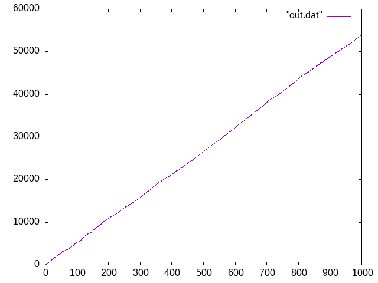

<link rel="stylesheet" type="text/css" href="main.css">

<a href="/blog">All articles</a>

# Solving a problem with Gnuplot, the programming language (not the plotting software)

*Is it any good? Can you solve real problems with it?*

Most people know [Gnuplot](https://en.wikipedia.org/wiki/Gnuplot) as a way to plot data. Two lines of code and we can visualize data:

```gnuplot
set output "plot.png"
plot "out.dat" with lines
```


where `out.data` is a text file with a number on each line.

The software engineering advice that I heard a long time ago and left a mark on me is: **Find a way to visualize your problem.**

So Gnuplot is definitely worth of a spot in a Software Engineer's toolbox.

However, few know that Gnuplot is actually a Turing complete programming language. It is similar in syntax to Perl or Awk. So I scratched an itch and solved a [problem](https://adventofcode.com/2023/day/1) with it.

**Table of Contents**
- [The problem](#the-problem)
- [Closing thoughts](#closing-thoughts)
- [Addendum: The full code](#addendum-the-full-code)

## The problem
 
In short, we get a text file where each line contains random ascii characters. For each line, we must find the first and last digit characters, combine them into an number and at the end output the sum of all these numbers.


The way we read the data into a variable is through a shell command:

```
data = system("cat 1a.txt")
```

Gnuplot has the `plot` command to turn input data into a plot, but nothing built-in to read input data into a variable, it seems. No matter, `system` which spawns a commmand in a subshell does the trick.

Since we need to check whether a character is a string, let's define our own little function for it. Yes, Gnuplot has user defined functions! The unfortunate limitation is that the body has to be an expression:

```gnuplot
is_digit(c) = c eq "0" || c eq "1" || c eq "2" || c eq "3" || c eq "4" || c eq "5" || c eq "6" || c eq "7" || c eq "8" || c eq "9"
```

Characters are not a thing; instead we deal with a string of length 1. Comparing strings for equality is done with the operator `eq`.

Then, we iterate over each line in the data. Gnuplot has a for-each construct we can use for that.

We then iterate over each character in the line with a for-range loop, isolating the 'character' (remember, it's just a string of length 1) with a slicing syntax that many modern languages have:

```gnuplot
sum = 0

do for [line in data] {
  len = strlen(line)

  do for [i = 1:len] {
    c = line[i:i]
  }
}
```

One thing to note here is that strings are 1-indexed and the slicing syntax is: `foo[start_inclusive:end_inclusive]`.

We then set `first` to the first digit character we find:

```gnuplot
do for [line in data] {
  len = strlen(line)

  first=""

  do for [i = 1:len] {
    c = line[i:i]
    if (is_digit(c)) {
      if (first eq "") {
        first = c
        break
      }  
    }
  }
}
```

We do the same for the last character, iterating in reverse order:

```gnuplot
  last = ""

  do for [i = len:1:-1] {
    c = line[i:i]
    if (is_digit(c)) {
      if (last eq "") {
        last = c
        break
      }  
    }
  }

```

Finally, we concatenate the two digits (which are still two strings of length 1 at that point) with the `.` operator, convert it to a number with the `+ 0` idiom, and increase our sum:

```gnuplot
  num = first . last + 0
  sum = sum + num
```

We just have to print the sum at the end:

```gnuplot
print(sum)
```

## Closing thoughts

Pretty straightforward, isn'it? Well, no. The language is weirdly restrictive, for example `sum += num` does not parse. `for` and `while` loops cannot for some reason be used interchangeably due to the weird `do` prefix for for-loops. Very few builtin functions are available.
There does not seem to be basic data structures such as arrays and maps. Every variable is global. And so on.

It's weird because the language also has very modern constructs that some mainstream languages still do not have, like the slicing syntax.

Awk, Lua or Perl are honestly better in every way, to pick relatively simple, dynamic languages that people usually reach to for Unixy text transformations. And these wo will have better tooling, such as a debugger. Heck, even shell scripting is probably easier and more straightforward, and that's a low bar.

Everything points to the fact that Gnuplot expects it's input data in some pre-arranged tabular form, and just wants to plot it, not transform it. That means that another (real) programming language is expected to do prior work and Gnuplot is at the end of the data pipeline as a 'dumb' visualization tool.


I'll investigate Julia and perhaps R in the future, which are in the same niche of science/data visualization but are a full programming language and plentyful tooling.


## Addendum: The full code

Run with `gnuplot my_file.dem`.

```gnuplot
data = system("cat 1a.txt")

is_digit(c) = c eq "0" || c eq "1" || c eq "2" || c eq "3" || c eq "4" || c eq "5" || c eq "6" || c eq "7" || c eq "8" || c eq "9"

sum = 0
do for [line in data] {
  len = strlen(line)

  first=""

  do for [i = 1:len] {
    c = line[i:i]
    if (is_digit(c)) {
      if (first eq "") {
        first = c
        break
      }  
    }
  }


  last = ""

  do for [i = len:1:-1] {
    c = line[i:i]
    if (is_digit(c)) {
      if (last eq "") {
        last = c
        break
      }  
    }
  }
  num = first . last + 0
  sum = sum + num
  system("echo " . sum . " >> out.dat")
}

print(sum)
```
